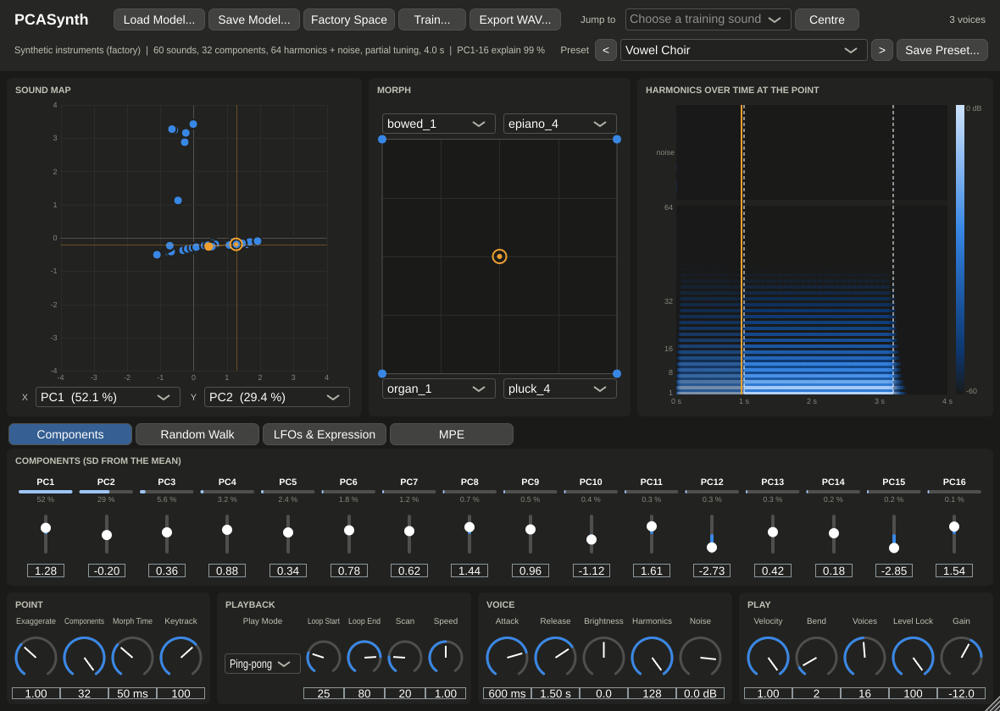
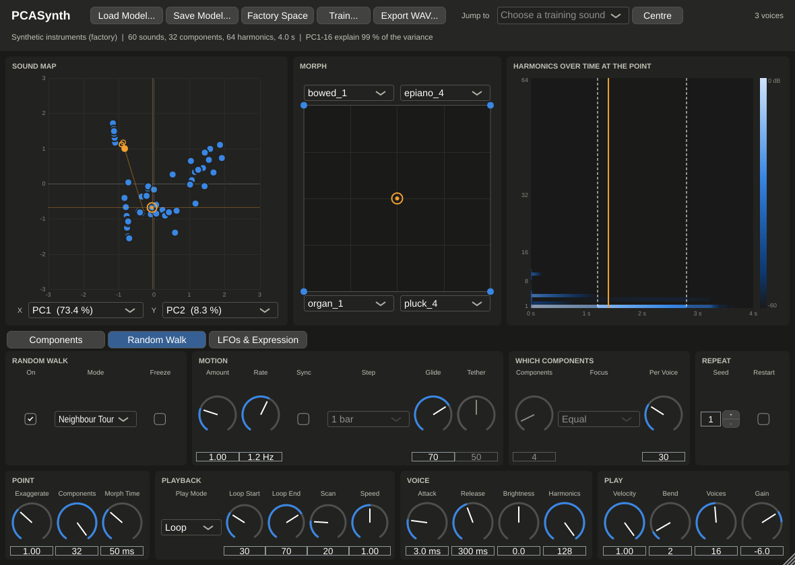
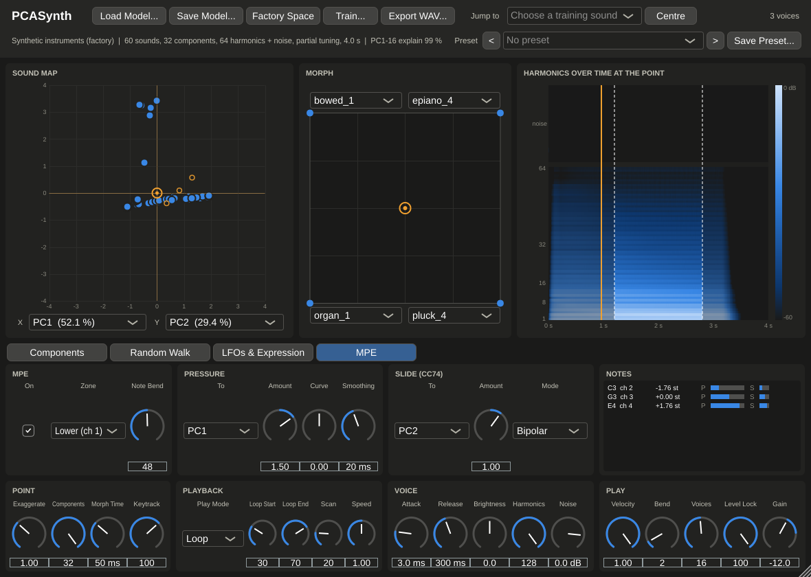
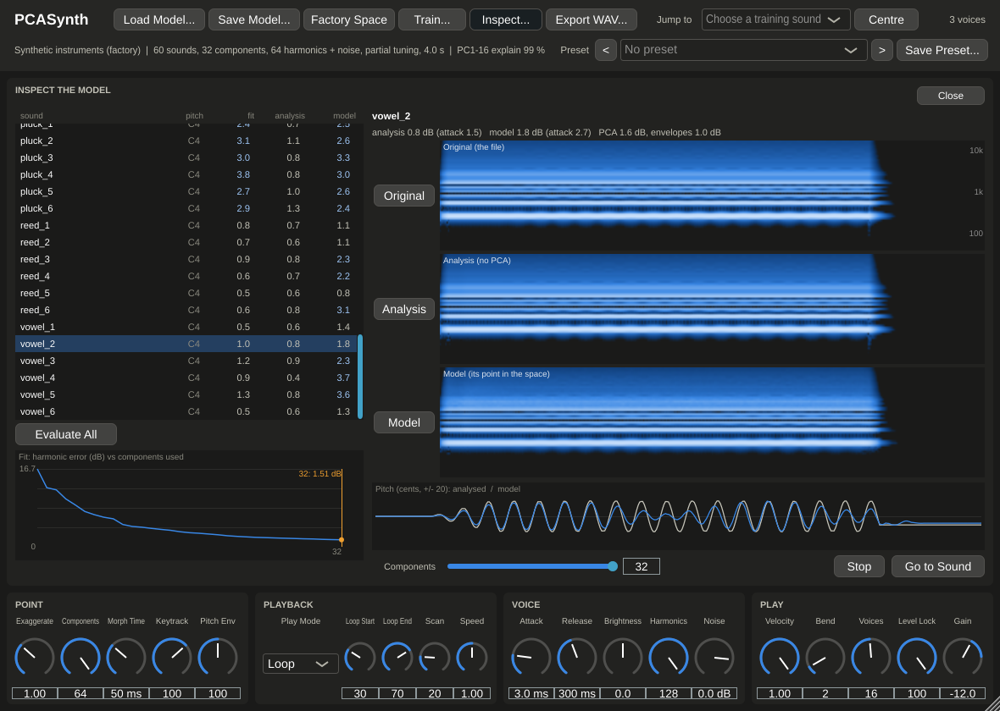
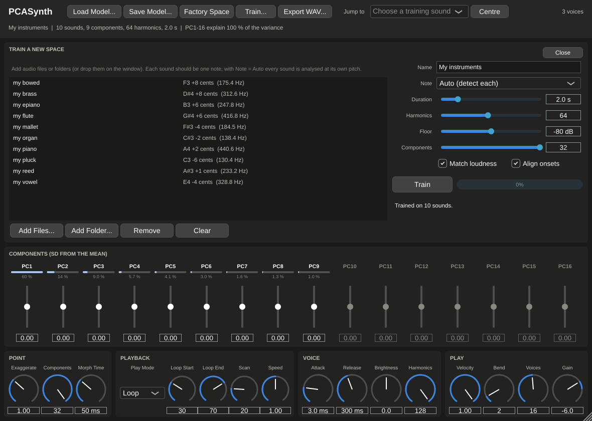

# PCASynth

An experimental synthesizer (VST3 for macOS) built on a **principal
components analysis of recorded notes**. Train it on a folder of WAVs of
different instruments all playing the same note. Each sound becomes a point
in a learned space, and you can play any point: the originals, morphs between
them, or places no instrument has been.

Sounds are analysed into **harmonic amplitude envelopes** (how loud each
harmonic is, every 10 ms), and PCA runs on those. Notes are resynthesised by a
bank of sine oscillators, so any pitch plays the learned timbre. See
[`plan.md`](plan.md) for the concept, the design and the staged build plan.

By [Matthew Crump](https://crumplab.com), Brooklyn College of CUNY.

**Status: version 0.9.0.** A playable VST3
(plus a Standalone app) with its own UI:
- a map of the sound space, a four-corner morph pad, a live view of the
  sound;
- factory and user presets;
- training on your own audio, and an **Inspect** panel that shows and
  plays how faithfully the space reproduces each sound;
- random walks, LFOs and expression;
- MPE for controllers such as the Osmose;
- a richer sound model: breath and bow noise, inharmonic (piano-like)
  partials, pitch curves (vibrato, glides), crisp attacks, and timbre that
  follows pitch when trained on several notes.

It has not yet been played in a DAW or on an Osmose.

**[Read the manual](docs/manual.md)** for every control, with tips.



## Install (macOS)

Download `PCASynth-macOS` from the latest successful
[build](../../actions/workflows/build.yml) run (or a release). Then either:

- run the `.pkg`, which installs `PCASynth.vst3` into
  `/Library/Audio/Plug-Ins/VST3` (and, under Customize, the Standalone app
  into `/Applications`), or
- copy `PCASynth.vst3` from the zip into `~/Library/Audio/Plug-Ins/VST3`.

Builds without the maintainer's Developer ID are ad-hoc signed (see
[`docs/RELEASING.md`](docs/RELEASING.md) for signed, notarized releases).
If macOS blocks the plugin, run
`xattr -dr com.apple.quarantine ~/Library/Audio/Plug-Ins/VST3/PCASynth.vst3`.
Rescan plug-ins in your DAW; PCASynth appears under CrumpLab as an
instrument. The zip also has the Standalone app, for trying it without a
DAW, and the manual.

## Playing it

Start with the **Preset** menu (top right). Factory presets cover
instruments, pads, random walks and MPE. **Save Preset…** stores the
current sound, including a trained space, as a `.pcspreset` file you can
share.

- **Sound map** (left): every training sound on two components (pick them
  under the map).
  - Click a dot to jump to that sound.
  - Drag anywhere else to move the point (orange ring) along those two
    components.
- **Morph** (middle): choose four sounds for the corners and drag the puck to
  blend them. Along one edge it morphs between two sounds.
- **Harmonics over time** (right): what the current point sounds like.
  - Each row is a harmonic (1 at the bottom); brighter is louder.
  - Dashed lines mark the loop; orange lines are the voices playing.
- **Components**: PC1–PC16 in standard deviations from the average sound
  (±2 covers most of the training set; ±4 goes beyond it). The bar above
  each shows how much of the variety in the training set that component
  captures. Double-click a slider to reset it.
- **Play Mode:**
  - **Loop** (default) sustains held notes between Loop Start and Loop End.
  - **One-shot** plays the recorded envelope once.
  - **Ping-pong** plays back and forth between the loop points.
  - **Scan** holds one moment of the sound (automate Scan).
- **Exaggerate** scales the whole point (0 = the average sound, 2 = twice as
  far out). **Components** keeps only the first K.
- **Noise** sets the level of the learned breath and bow noise ("off" = pure
  harmonics). **Keytrack** sets how much timbre follows pitch, for spaces
  trained on several notes.
- **Level Lock** (default 100 %) keeps every point near the training sounds'
  loudness. Far-out points can otherwise be tens of dB louder or quieter.
- **Jump to** / **Centre** go to a training sound or the average.
  **Export WAV…** renders the last note you played at the current point.
- **Load Model…** or drop a `.pcsm` file on the window to play a saved
  space. **Save Model…** writes the current one. The space in use is saved
  inside your project.

## Movement

The **Random Walk** tab sets the point wandering. Switch it **On** and
choose a mode:
- **Drift:** slow Brownian wandering. **Tether** pulls it back home.
- **Jumps:** a new random point every step. **Glide** turns the jumps into
  sweeps.
- **Tour:** travels from one training sound to another.
- **Neighbour Tour:** travels to a similar sound each step, so it drifts
  through families.

Other walk settings:
- **Amount** is how far it goes, in SD. In tours, 1 means arriving at each
  sound.
- **Rate** is steps per second, or turn on **Sync** to step with your DAW's
  tempo.
- **Components** and **Focus** choose what wanders.
- **Per Voice** lets every note of a chord wander on its own.
- **Seed** plus **Restart** repeats the same path each time you start
  playing. **Freeze** holds it where it is.

The map shows where the walk is (filled orange dot) and its recent trail.

The **LFOs & Expression** tab has:
- two LFOs that can target any component;
- velocity, mod wheel and aftertouch routing;
- **Toward Sound:** pick a training sound. Any source set to "Toward Sound",
  and the **Macro** knob, moves the point along the line towards it. By
  default the mod wheel does this.
- **Spread:** each note of a chord starts at a slightly different point.



## MPE (Osmose and other MPE controllers)

Open the **MPE** tab and switch **On**. If your controller sends its MPE
configuration, this happens by itself. Then:
- Each note bends on its own. Set **Note Bend** to match the controller: the
  Osmose defaults to 48 semitones.
- **Pressure** moves each note through the space on its own: by default
  along PC1, or toward a chosen sound (set the sound on the LFOs &
  Expression tab). **Curve** shapes the response (above 0 = more from a
  light touch) and **Smoothing** steadies it.
- **Slide** (CC74) is a second per-note direction (default PC2).
- The **Notes** monitor shows what each note receives (channel, bend,
  pressure, slide). Check it if something feels off.
- The sound map shows each note's own point as you play.

With MPE off, the plugin behaves as an ordinary synth.



## Training your own space

1. Click **Train…**, then **Add Folder…**, or drop audio files or folders
   onto the window. WAV, AIFF, FLAC and Ogg work everywhere; MP3/M4A work
   on macOS.
2. Each file should be a single note. Set **Note** to the note they all
   play, or to **Auto** to detect each sound's pitch, so a set can mix
   notes.
3. Click **Train**. Analysis runs in the background. The list shows each
   sound's detected pitch, and flags any file that failed.
4. The new space replaces the current one, starting at its centre.

**Richer training options:**
- **Noise bands** keep breath, bow and hammer noise; 0 = harmonics only.
- **Partial tuning** learns stretched, inharmonic partials (pianos, bells).
- **Levels as** chooses how levels are represented:
  - Decibels (default): morphs blend spectral shapes.
  - Shape + loudness: the loudness envelope is separate from the spectrum's
    shape.
  - Linear: morphs behave more like crossfades.
- **Pitch tracking:** give it several notes per instrument (e.g. C3, C4, C5)
  and it learns how timbre changes with pitch. Each note then gets its
  register's timbre; the **Keytrack** knob sets how much.

**Fidelity:**
- **Harmonics** sets the highest frequency kept (harmonics × pitch): use 128
  for low notes.
- **Pitch curve** learns vibrato and glides.
- **Sharp attacks** keeps plucks crisp.
- **Components** goes up to 64.

Then click **Inspect…** to compare each sound's original, its analysis and
its point in the model, with scores, spectrograms and A/B playback. The
[manual](docs/manual.md#11-inspecting-the-model) explains what to change
for what you find.



Removing sounds or changing Components retrains quickly (analysed sounds
are cached). Your project remembers the file list and settings, and
**Save Model…** keeps the space as a file.



## Build

Requires CMake ≥ 3.22 and a C++20 compiler. Dependencies (JUCE,
nlohmann/json, Catch2) are fetched by CMake. On Linux JUCE needs the ALSA,
X11 and freetype development packages (see `.github/workflows/build.yml`).
`-DPCS_BUILD_PLUGIN=OFF` builds only the engine and tools.

```sh
cmake -S . -B build -DCMAKE_BUILD_TYPE=Release
cmake --build build --parallel
ctest --test-dir build
```

## Tools

```sh
# Synthetic training set: 10 instrument families × 6 variations, all C4
build/tools/pcs-testgen training/

# Train a model on any folder of WAVs playing the same note (then load it in the plugin)
build/tools/pcs-train -o space.pcsm --title "My space" --note 60 training/

# Render a point: a training sound, a morph, or an offset along components
build/tools/pcs-render space.pcsm out.wav --sound reed_1 --to vowel_2 --amount 0.5 --notes 48,55,64 --mode loop
build/tools/pcs-render space.pcsm out.wav --z 2,-1,0.5 --length 4

# Everything at once: training set, model, listening examples and a map
scripts/render_examples.sh build renders

# How faithfully a model reproduces its training files (scores; --out DIR writes A/B WAVs)
build/tools/pcs-inspect space.pcsm training/

# CPU use of the synth in a few stress cases
build/tools/pcs-bench space.pcsm
```

## Licence

AGPLv3 (see [`LICENSE`](LICENSE)).
