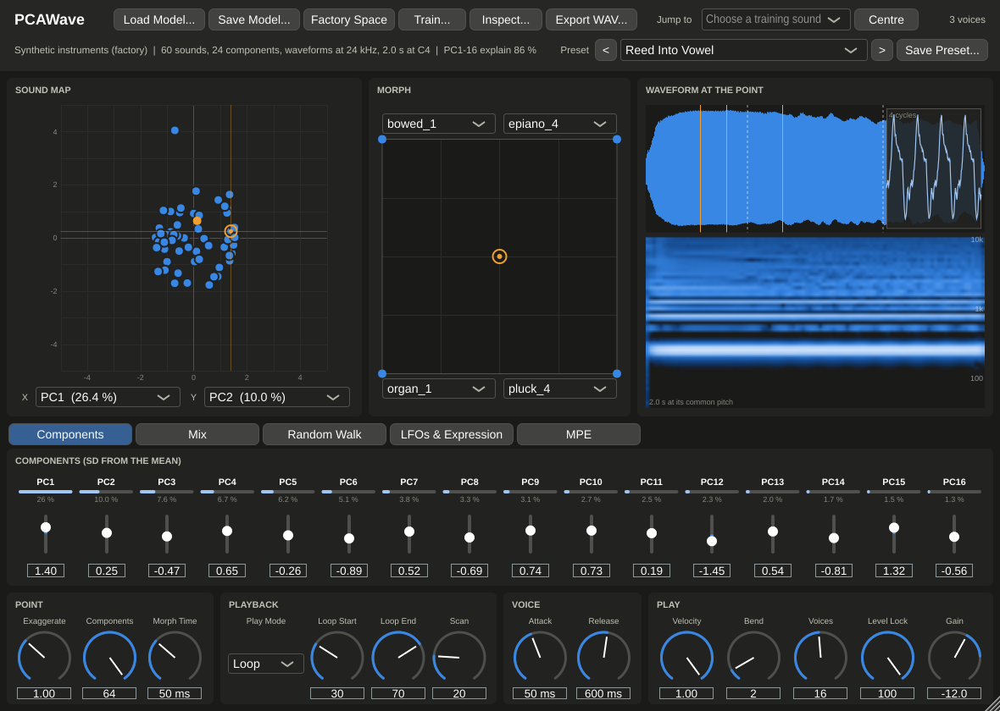
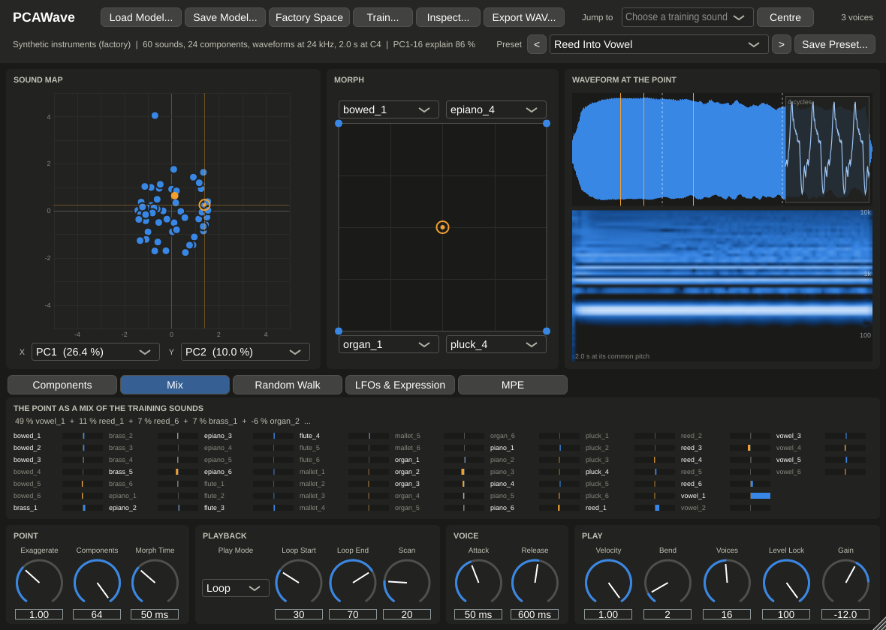
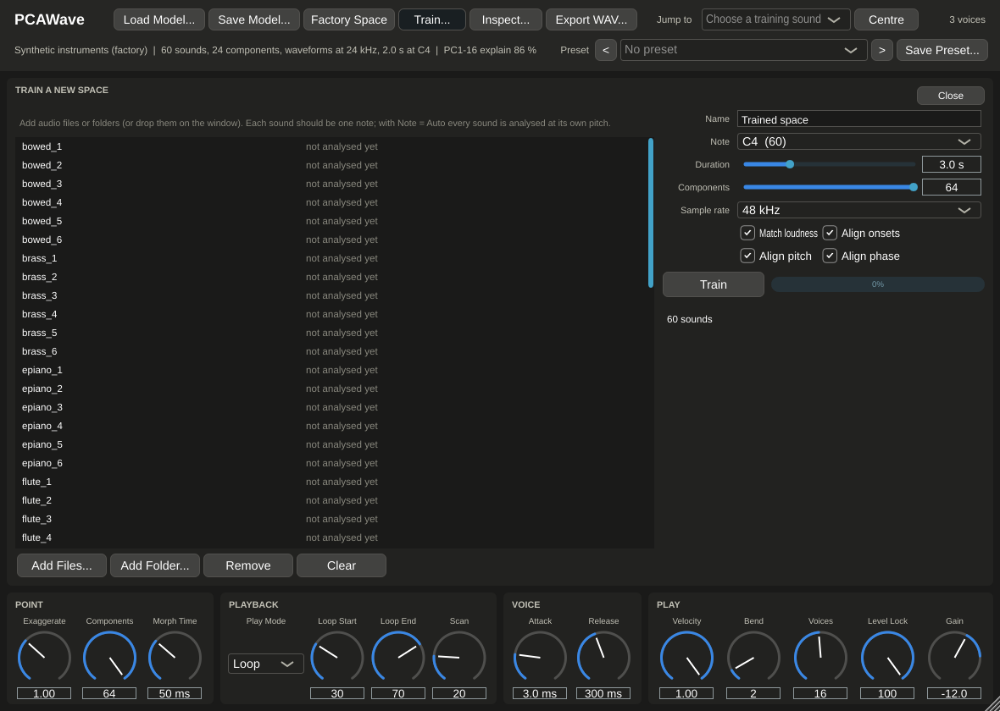
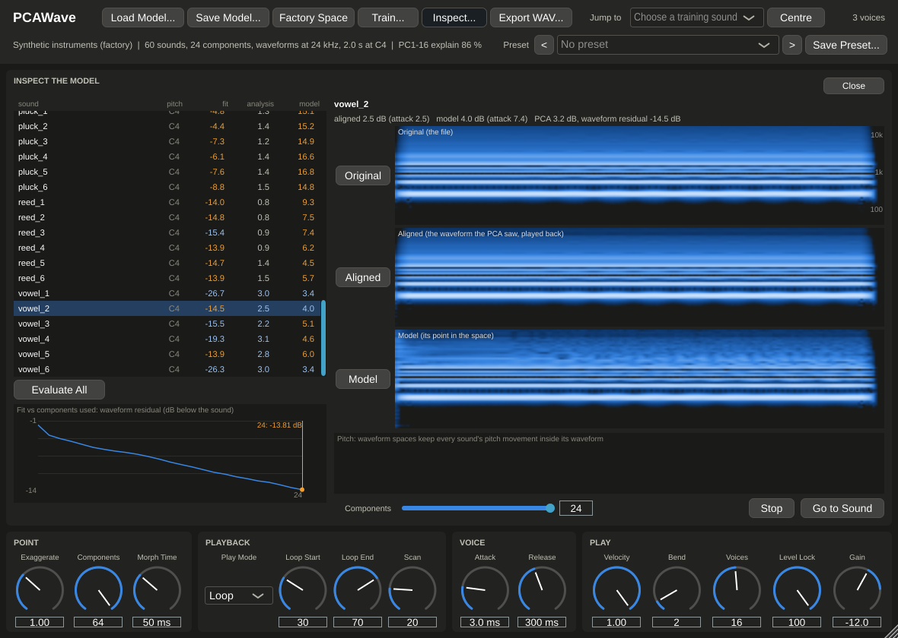

# PCAWave manual

Version 0.10.0 · [Matthew Crump](https://crumplab.com), Brooklyn College of CUNY

PCAWave is the sister plugin of PCASynth. Both play **a space of sounds
learned from recordings**, but PCAWave runs the PCA **directly on the
waveforms** instead of on harmonic envelopes. That makes it a *linear morph
synthesizer*:

- every training sound plays back as itself, sample for sample (breath,
  hammer thumps, clicks and all: nothing is thrown away by an analysis);
- every other point in the space is a **mix of the training waveforms**,
  and the new **Mix** tab shows exactly which mix you are hearing.

Most of the plugin is shared with PCASynth: the sound map, morph pad,
presets, random walk, LFOs and expression, MPE, training and the Inspect
panel work the same way. This manual covers what is different, and links
to the [PCASynth manual](manual.md) for the rest.

- [1. How it works](#1-how-it-works)
- [2. PCAWave or PCASynth?](#2-pcawave-or-pcasynth)
- [3. The window](#3-the-window)
- [4. The Mix tab](#4-the-mix-tab)
- [5. Playback and the voice](#5-playback-and-the-voice)
- [6. Presets](#6-presets)
- [7. Training a waveform space](#7-training-a-waveform-space)
- [8. Inspecting the space](#8-inspecting-the-space)
- [9. Files, size and performance](#9-files-size-and-performance)
- [10. Parameter reference](#10-parameter-reference)

---

## 1. How it works

**Training** lines the recordings up so that PCA can compare them sample
for sample:

1. **Pitch.** Each sound's pitch is measured and the sound is resampled to
   one common pitch (the **Note**, or with Note = Auto the median pitch of
   the set). After this every sound has the same period.
2. **Onset.** Silence before the note is cut, keeping 1 ms before the
   onset.
3. **Phase.** Each sound is slid by up to half a period so that its cycles
   line up with the average of the sounds before it. This is what keeps
   mixes from comb-filtering: two waveforms that are in phase add up to a
   hybrid, two that are not partly cancel.
4. **Loudness.** The loudest 50 ms of each sound is set to the same level.
5. **Length.** Every sound is cut (or padded) to the same **Duration**,
   with a 50 ms fade at the end.

PCA then finds the main ways the aligned waveforms differ. A point in the
space is the mean waveform plus each component times its score, one full
waveform (seconds long) per point.

**Playing** a note plays that waveform back, resampled to the note's
pitch, like a sampler whose sample is computed from the point. Moving the
point (the map, the pad, the sliders, a walk, an LFO, MPE) changes the
waveform smoothly while it plays: every sample of every voice is a
weighted sum of the mean and the components, with the weights following
the point sample by sample.

**Because PCA is linear, every point is a mix of the training sounds.**
The weights sum to 100 %. At a training sound, that sound has 100 % and the
others 0 %; halfway between two sounds, each has 50 %. Further out the
weights can go negative (a sound *subtracted*) or above 100 %: that is where
new sounds are, and where levels can run away (see Level Lock, §5).

## 2. PCAWave or PCASynth?

| | PCASynth | PCAWave |
|---|---|---|
| PCA runs on | harmonic envelopes (dB per harmonic, every 10 ms) | the waveforms themselves |
| A training sound plays back | as its analysis (close; transients and some noise simplified) | exactly, as recorded (after alignment) |
| Between two sounds | a hybrid timbre: harmonics' levels in between | a mix: both sounds at once, aligned so they blend |
| Other pitches | resynthesised: the timbre stays put, only the pitch moves | resampled: like a sampler, the timbre moves with the pitch |
| Speed, Brightness, Harmonics, Noise, Keytrack, Pitch Env | yes | no (no harmonics to tilt, no envelope to speed up) |
| Components needed to reproduce the sounds | few (the envelopes are simple) | nearly all (waveforms are very different) |
| Space size | ~1 MB | 5–40 MB |

Choose PCAWave when you want the recordings themselves, crossfaded along
learned directions: a morph synth whose corners are real sounds. Choose
PCASynth for hybrids that no single recording contains, and for playing
far from the recorded pitch.

## 3. The window

The window is the same as PCASynth's ([manual §3](manual.md#3-the-window))
except:

- **Load Model… / Save Model…** open and save waveform spaces (`.pcsw`).
  PCAWave will not load a PCASynth space (`.pcsm`), and PCASynth will not
  load a `.pcsw`.
- The summary under the buttons gives the waveform rate, the duration and
  the common pitch (for example *waveforms at 24 kHz, 2.0 s at C4*).
- **Waveform at the point** (right) replaces *Harmonics over time*:
  - top: the whole waveform at the current point, with the loop points
    (dashed) or the scan grain, and an orange line for each sounding voice;
  - the inset on the right: four cycles at the loop start (or scan
    position), at the common pitch, so you can see the wave shape change as
    you move;
  - bottom: a spectrogram of the waveform (100 Hz to 10 kHz, log scale),
    for the harmonics and noise that the plot above can't show.
- **Tabs:** Components, **Mix** (§4), Random Walk, LFOs & Expression, MPE.

## 4. The Mix tab

The point you are hearing, as a mix of the training sounds.

- The line at the top lists the largest contributions, for example
  *49 % vowel_1 + 11 % reed_1 + 7 % reed_6 − 6 % organ_2 …*.
- Below, every training sound has a bar from the centre of its cell: blue
  to the right adds that sound, orange to the left subtracts it. Bars are
  scaled to the largest weight. Sounds with a weight under 5 % of the
  largest are dimmed.
- Click a sound's name to jump to it.
- With many sounds, as many as fit are shown: the most heavily weighted
  ones, in their usual order (the top line says so).

While a walk, LFO or MPE moves the point, the tab follows the point you are
actually hearing.

The weights are exact at every point, whatever Components and Exaggerate
are set to: each component is itself a combination of the training sounds,
so any point is one too. (Of the many mixes that make the same waveform,
the tab shows the one with the smallest weights.)

## 5. Playback and the voice

**Play Mode** (as in PCASynth, [§6](manual.md#6-playback-and-the-voice)),
applied to the waveform:

- **Loop** (default): plays up to **Loop End**, then loops between **Loop
  Start** and Loop End, with a 50 ms crossfade at the loop point.
- **One-shot**: plays the waveform once, like the recording.
- **Ping-pong**: forwards and backwards between the loop points.
- **Scan**: loops an 80 ms grain around **Scan**, crossfaded, for a frozen,
  wavetable-like tone. Move Scan, or the point, for movement.

The loop and scan positions are fractions of the space's **Duration**.

There is no Speed knob: the waveform plays at the note's pitch, and speeding
it up would change the pitch. Brightness, Harmonics, Noise, Keytrack and
Pitch Env are left out too; there are no harmonics to tilt or cut, and the
waveform already contains the sound's noise and pitch movement.

**Level Lock** (0–100 %, default 100 %). Mixes of waveforms can be louder
(sounds in phase) or quieter (sounds partly cancelling) than any training
sound, and far from the training sounds, much louder. At 100 %, every point
plays at the training sounds' loudness (the level over the first 0.5 s, with
cuts as deep as needed and boosts up to 12 dB). The training sounds
themselves are unchanged.

**Other pitches.** A note plays the waveform resampled from the space's
common pitch. As with a sampler, an octave up is twice as fast (the sound
is half as long and its formants move up); keep to within an octave or so
of the common pitch for the most natural sound, or train on the pitch you
want to play.

The Attack, Release, Velocity, Bend, Voices and Gain knobs are as in
PCASynth.

## 6. Presets

Presets work as in PCASynth ([manual §4](manual.md#4-presets)); user presets
are kept in their own folder (on macOS,
`~/Library/Audio/Presets/CrumpLab/PCAWave`). The factory set:

| Category | Preset | What it shows |
|---|---|---|
| Basic | Init | The average waveform, looped |
| Sounds | Reed, Bowed, Electric Piano, Mallet | Training sounds as recorded (Electric Piano and Mallet one-shot) |
| Mixes | Reed Into Vowel | Macro morphs from reed_1 to vowel_1 |
| | Mod Wheel Morph | The mod wheel morphs flute_2 into brass_2 |
| | Frozen Grain | Scan mode on organ_2, a slow LFO on PC1 |
| Random Walk | Drifting Mix | A slow drift around vowel_2 |
| | Sound Tour | Visits every training sound in turn |
| | Neighbour Steps | Steps to nearby sounds, a quarter note at a time |
| | Chord Of Mixes | Each note of a chord wanders on its own |
| MPE | MPE Press To Mix | Pressure morphs reed_3 into brass_1; slide moves PC1 |

## 7. Training a waveform space

Open **Train…**, add files or folders, and press **Train**, as in PCASynth
([manual §10](manual.md#10-training-your-own-space)). The settings:

- **Name**: the space's title.
- **Note**: the common pitch every sound is resampled to. **Auto** (the
  default) uses the median pitch of the set, so the least resampling is
  done overall. With a Note set, each sound's pitch is looked for within
  60 cents of it; with Auto, anywhere.
- **Duration** (0.5–10 s, default 3 s): how much of each sound, from its
  onset. Longer spaces are bigger (§9).
- **Components** (default 64): at most one fewer than the number of sounds.
  Waveform spaces need nearly all of them to reproduce the training sounds
  (see §8), so keep the maximum unless the space is too big.
- **Sample rate** (48, 32 or 24 kHz): the rate the waveforms are stored at.
  24 kHz halves the size of the space and still reaches 12 kHz; use 48 kHz
  for bright, noisy sounds.
- **Match loudness**: set every sound's loudest 50 ms to the same level.
- **Align onsets**: cut the silence before each note.
- **Align pitch**: resample every sound to the Note. Turn it off only for
  sounds that are already at the same pitch (or unpitched).
- **Align phase**: line the sounds' cycles up. Turn it off to hear why it
  matters: mixes of unaligned sounds are hollow and phasey.

**What to train on.** One note per file, all near the same pitch, as
cleanly cut as you can. Sounds that vary a lot in pitch over time (deep
vibrato, glides) line up less well and mix less cleanly. Sustained sounds
make the best loops.

The training settings are saved with your project.

## 8. Inspecting the space

The Inspect panel works as in PCASynth
([manual §11](manual.md#11-inspecting-the-model)), with these differences:

- The second version is **Aligned**, not Analysis: the sound as the PCA saw
  it (pitch-shifted to the common pitch, trimmed, phase-aligned and
  loudness-matched), played back at the sound's own pitch. The *analysis*
  score compares it with the original; it should be small (resampling
  loses almost nothing).
- **Model** plays the sound's point in the space. With all components it
  equals Aligned.
- **Fit** (in the list and the chart) is the waveform residual: how far
  below the sound the part the components miss is, in dB. −20 dB is a
  close copy; −60 dB and below is exact. The chart shows the mean residual
  against the number of components kept.

On the 60 synthetic sounds the aligned versions score 0.59 dB against the
originals (PCASynth's analysis: 1.39 dB). But the model needs nearly all
its components: with 16 the residual is about −12 dB, with 32 about −9 dB
below each sound. Waveforms of different instruments share little, so each
component carries mostly one or two sounds. This is why the Mix tab is
useful: it says which.

## 9. Files, size and performance

A waveform space stores one waveform per component plus the mean:

  size ≈ (components + 1) × duration × sample rate × 4 bytes

For 60 sounds (59 components) of 3 s at 48 kHz that is about 35 MB; the
factory space (24 components, 2 s at 24 kHz) is 4.8 MB. Spaces are saved
inside your project, so large ones make large projects. Lower the Sample
rate or Duration, or the Components, to make them smaller.

**CPU.** Each voice computes a weighted sum over all components for every
sample. On a modern laptop core, 16 notes of a 59-component 48 kHz space
use about 5 % of one core, and 32 MPE notes about 7 %.

## 10. Parameter reference

The same as PCASynth's ([manual §15](manual.md#15-parameter-reference)),
without Speed, Brightness, Harmonics, Noise, Keytrack and Pitch Envelope.
Components Used runs to 64; a space with fewer components uses all of its
own at the maximum.
